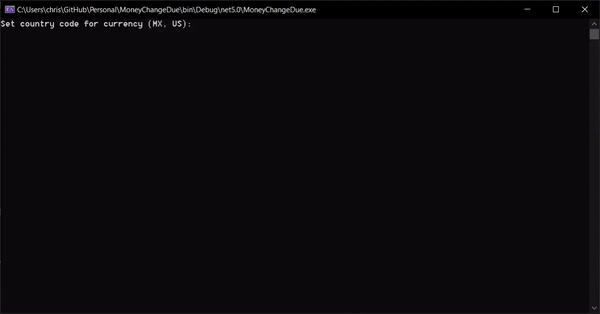

# MoneyChangeDue
C# based console program that calculates the optimum amount of bills and coins to return for a paid product.

Instructions for usage:

1. Clone this repository
2. Open **MoneyChangeDue.sln** file with Visual Studio
3. Compile and enjoy!

This program calculates the optimum change details based on a product price and paid amount. Money denominations can be added per country under the **MoneyDenomination** class.

